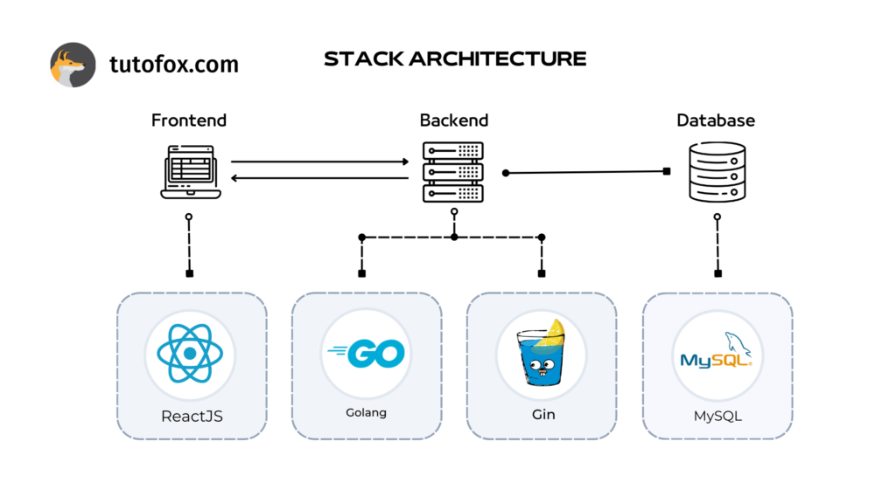

# Basic design (基本設計)

## Technology stack

- backend
  - GO
  - Gin
- frontend
  - npm
  - Vite
  - React
  - TypeScript
  - [Tailwindcss](https://tailwindcss.com/)
- API
  - Google Books API
- DB
  - MySQL
