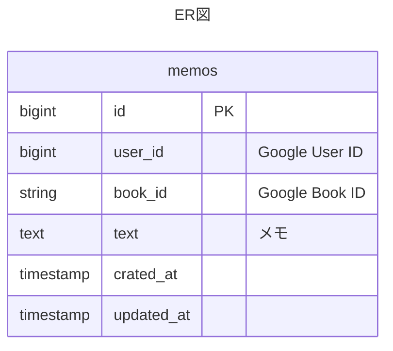

# Detail design (詳細設計)

## Software architecture

- backend
  - [Clean Architecture](https://blog.cleancoder.com/uncle-bob/2012/08/13/the-clean-architecture.html)
  - [Domain-Driven Design](https://martinfowler.com/bliki/DomainDrivenDesign.html)

## DB

## ディレクトリ構造

book-tracker-v2/
├── .vscode/
│   └── .settings.json
├── backend/
|    ├── config/               # 設定関連
|    ├── domain/               # ドメイン層（エンティティ、リポジトリインターフェース）
|    │   ├── book.go           # 書籍エンティティ
|    │   └── bookshelf.go      # 書棚エンティティ
|    ├── usecase/              # ユースケース層
|    │   ├── book_usecase.go   # 書籍関連のユースケース
|    │   └── bookshelf_usecase.go # 書棚関連のユースケース
|    ├── interface/            # インターフェース層（ハンドラー、リポジトリ実装）
|    │   ├── handler/          # HTTPハンドラー
|    │   │   ├── book_handler.go
|    │   │   └── bookshelf_handler.go
|    │   └── repository/       # リポジトリ実装
|    │       ├── book_repository.go
|    │       └── bookshelf_repository.go
|    ├── infrastructure/       # インフラ層（外部サービスやデータベース接続）
|    │   ├── db.go             # データベース接続
|    │   └── google_books.go   # Google Books APIクライアント
|    └── main.go               # エントリーポイント
├── frontend/
│   └── Dockerfile
├── .coderabbit.yaml
└── docker-compose.yml

[Reference](https://tree.nathanfriend.com/?s=(%27options!(%27fancy!true~fullPath!false~trailingSlash!true~rootDot!false)~5(%275%27book-tra4-v2*.vscode*3.settings.json*back0font0.coderabbi6do4-compose6%27)~version!%271%27)*%5Cn30end*3Do4file*3%20%204cker5source!6.yml*%0165430*)
