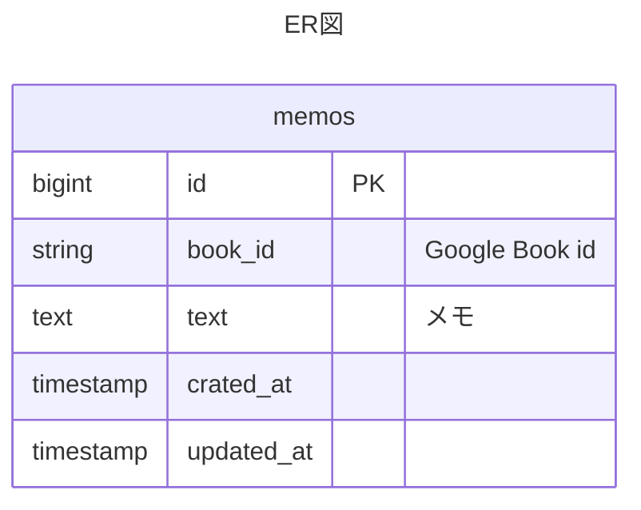

# Basic design (基本設計)

## 使用技術
- backend
  - GO(Gin)
- frontend
  - npm
  - Vite
  - React
  - TypeScript
- API
  - Google Books API
- DB
  - MySQL

## ソフトウェアアーキテクチャ
- backend
  - BFF?
  - DDD

## DB



## ディレクトリ構造
```
book-tracker-v2/
├── .vscode/
│   └── .settings.json
├── backend/
│   └── Dockerfile
├── fontend/
│   └── Dockerfile
├── .coderabbi.yml
└── docker-compose.yml
```
[Reference](https://tree.nathanfriend.com/?s=(%27options!(%27fancy!true~fullPath!false~trailingSlash!true~rootDot!false)~5(%275%27book-tra4-v2*.vscode*3.settings.json*back0font0.coderabbi6do4-compose6%27)~version!%271%27)*%5Cn30end*3Do4file*3%20%204cker5source!6.yml*%0165430*)