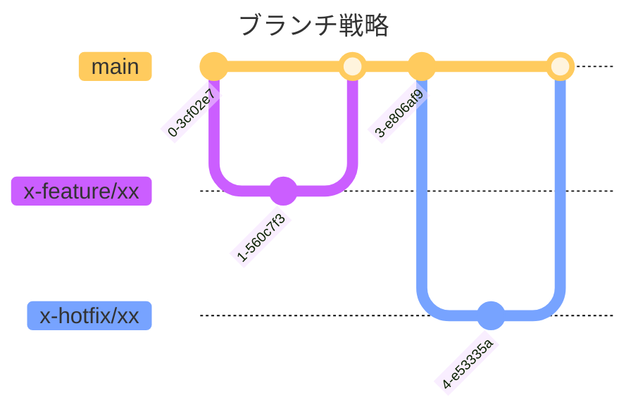

# Git

## ブランチ戦略

- Github Flow

```mermaid
---
title: ブランチ戦略
---
gitGraph
%%{init: {
    'gitGraph': {
        'mainBranchName': 'main'
    },
    'theme': 'base'
}}%%

    commit
    branch x-feature/xx

    commit
    checkout main
    merge x-feature/xx

    commit
    branch x-hotfix/xx

    commit
    checkout main
    merge x-hotfix/xx
```

- tr
    - tr
